# DEPLOYMENT OF A MICROSERVICE APPLICATION ON KUBERNETES USING TERRAFORM AS IaaC

## Project Overview: 

**Objective:** 
We aim to deploy a microservices-based application, specifically the Socks Shop, using a modern approach that emphasizes automation and efficiency. The goal is to use Infrastructure as Code (IaaC) for rapid and reliable deployment on Kubernetes.

Link to application repo on github:
[socks shop microservice application](https://github.com/microservices-demo/microservices-demo.github.io)


**Aim:** 
The aim of this project is to set up the Socks Shop application, a demonstration of a microservices architecture, available on GitHub. We'll be using tools and technologies that automate the setup process, ensuring that the application can be deployed quickly and consistently.

## PROJECT DELIVERABLES
- All deliverables need to be deployed using an Infrastructure as Code approach.
- Readability and maintainability (make yor application deployment clear)
- A clear way to recreate the setup and will evaluate the project decisions based on:
    ```
    Deploy pipeline
    Metrics (Alertmanager)
    Monitoring (Grafana)
    Logging (Prometheus)
    ```
- The application should use Prometheus as a monitoring tool
-  The application should use Ansible or Terraform as the configuration management tool
-  The application should use anY IaaS provider
-  The application should run on Kubernetes

## PROJECT REQUIREMENTS
- AWS Account
- IAM User Credentials
- Terraform
- Kubernetes
- Kubectl
- Prometheus
- Helm
- CICD (Github Actions)

# Step 1:

### The first step is to download all and configure all the tools required to implement this project. Tools like AWS CLI, Terraform, kubectl

- AWS CLI
    Create an AWS Account [HERE](https://aws.amazon.com/free/?gclid=Cj0KCQjwzby1BhCQARIsAJ_0t5PloPO6_AZmfWRFblBUfZ3wER05XP0LzfwiDr4-u4scemxMVSRQiXcaAmjVEALw_wcB&trk=99f831a2-d162-429a-9a77-a89f6b3bd6cd&sc_channel=ps&ef_id=Cj0KCQjwzby1BhCQARIsAJ_0t5PloPO6_AZmfWRFblBUfZ3wER05XP0LzfwiDr4-u4scemxMVSRQiXcaAmjVEALw_wcB:G:s&s_kwcid=AL!4422!3!645125273279!e!!g!!aws%20sign%20up!19574556890!145779847592)

    Download AWS CLI [HERE](https://aws.amazon.com/cli/)

    Configure the AWS CLI with your IAM User credentials
    ```
    aws config

    $ AWS Access Key ID [None]: <YOUR_AWS_ACCESS_KEY_ID>

    $ AWS Secret Access Key [None]: <YOUR_AWS_SECRET_ACCESS_KEY>

    $ Default region name [None]: <YOUR_AWS_REGION>
    
    ```

- Terraform
    Download Terraform [HERE](https://developer.hashicorp.com/terraform/install)

- kubectl
    Download Terraform [HERE](https://kubernetes.io/docs/tasks/tools/)

# Step 2:

 ### After having installed the necessary tools, the nest step now is to provision our cluster. We will be using EKS cluster for this project.

 In order to do this, we would be utilizing the learn EKS documentation by Hashicorp.

 - Create a project folder

 - Clone this repo 
    ```
    git clone https://github.com/YekAz/Microservice-Application--Deployment.git
    ```
 - cd into the terraform directory in the project folders and initialize terraform
    ```
    cd Terraform
    terraform init
    ```
 - Check for the infra that would be provisioned using:
    ```
    terraform plan
    ```
 - Create the kubernetes cluster with:
    ```
    terraform apply --auto-approve
    ```
 - Here is a screenshot of my kubernetes cluster (EKS):
    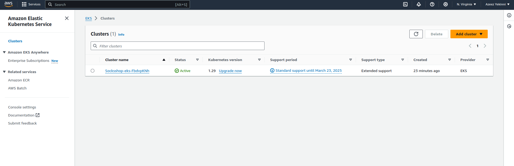

# Step 3:

### Next step is to connect our kubectl to our cluster so we can have access to it on Kubernetes. Run the following command to retrieve the access credentials for your cluster and configure kubectl.
    
    aws eks --region $(terraform output -raw region) update-kubeconfig \
    --name $(terraform output -raw cluster_name)

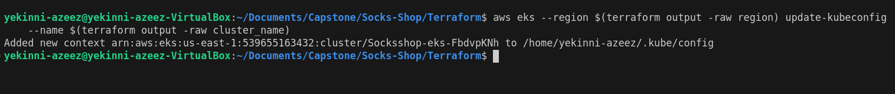

### Deploy the microservices on the cluster using the Kubernetes manifest
    kubectl create -f ../k8s/deployment.yml

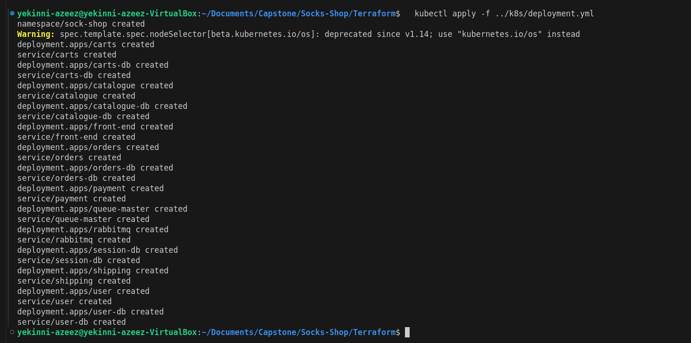

This command would create a namespace `sock-shop` and deploy the microservices on the cluster. You can confirm the pods by running the following command:

#### First switch from the default namespace to the sock-hop namespace where the microservices are deployed.

    kubectl config set-context --current --namespace=sock-shop

#### Confirm that you are in the sock-shop namespace:

    kubectl config view --minify | grep namespace:

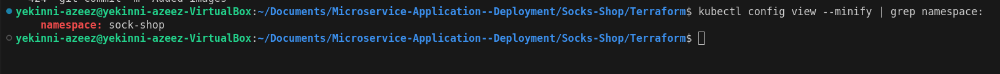

#### Then check if your pods are running:
    
    kubectl get pods

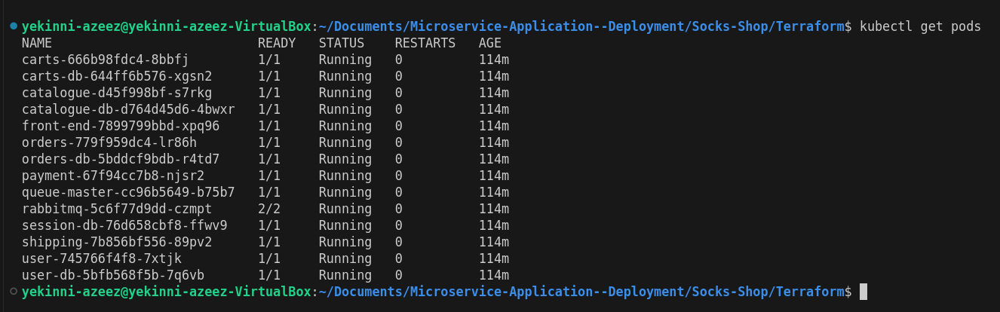

#### Confirm that the services are also running:

    kubectl get svc

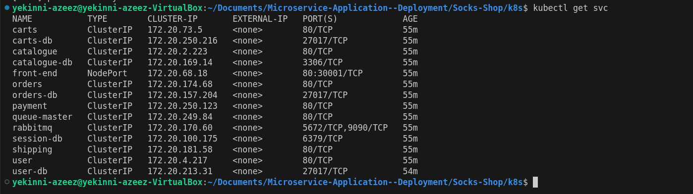


# Step 4:
### Serve the application front-end using NGINX Ingress Controller

#### Deploy an Ingress controller:

There are various ingress controllers but we will be using the NGINX Ingress Controller for this project. Run the command below to deploy the NGINX Ingress Controller:

    kubectl apply -f https://raw.githubusercontent.com/kubernetes/ingress-nginx/main/deploy/static/provider/cloud/deploy.yaml


#### Create and apply an Ingress resource file

Next, create an Ingress resource that routes traffic to your front-end service. This is achieved by applying the `ingress.yml` file.

    kubectl apply -f ingress.yml

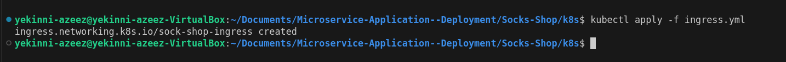

#### Check for the address of the Ingress load balancer using the command below:

    kubectl get ing

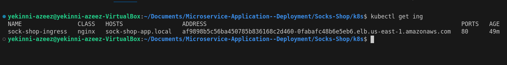
    
#### Check for the ip address of the public address of the ingress load balancer using:

    nslookup <ADDRESS copied from above>

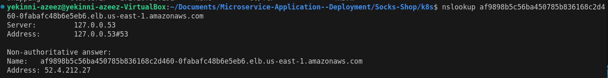

#### Map the DNS to the hostname
To do this, you have to map the ip address you get from above to the hostname in your `ingress.yml` file.

    sudo vim /etc/hosts

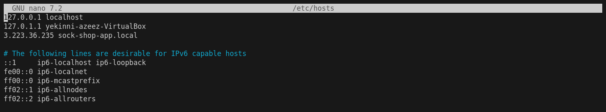

#### Access the front-end of the application on your local browser
Here, my hostname is `sock-shop-app.local` in my `ingress.yml` file.

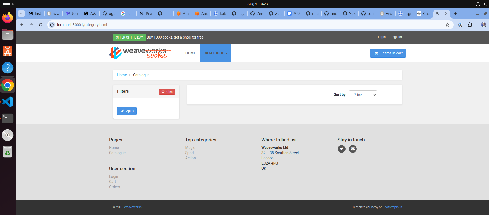

# Step 5:
### Monitoring

For this project, we will be using Prometheus and Grafana for monitoring. Using Prometheus and Grafana together provides a robust solution for monitoring and observability. Prometheus excels at collecting and storing time-series data, while Grafana offers powerful visualization and alerting capabilities. Together, they help ensure our application and infrastructure are running smoothly and efficiently, providing valuable insights for troubleshooting and optimization.

View the full steps to achieving the monitoring in the .

But here is a view of the results of the monitoring implementation using `Prometheus` and `Grafana`

### Prometheus

Prometheus Deployment

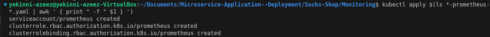

-------------------------------------------------------------------

Prometheus Data

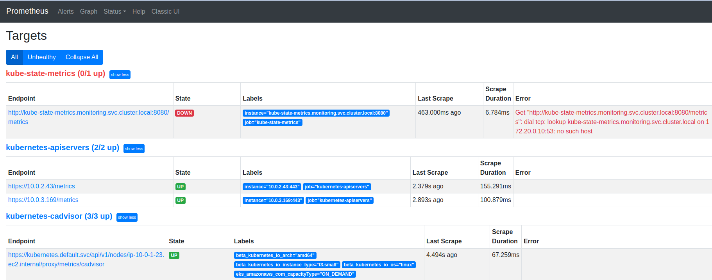

### Grafana

Grafana Deployment

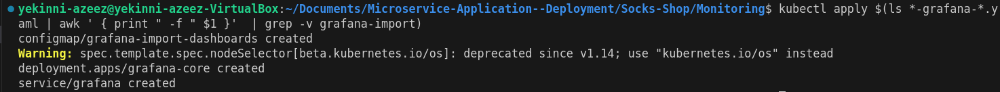

-------------------------------------------------------------------

Grafana Dashboard showing `memory usage of all nodes`

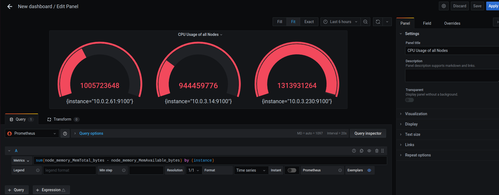

-------------------------------------------------------------------

Grafana Dashboard showing `CPU usage of all nodes`

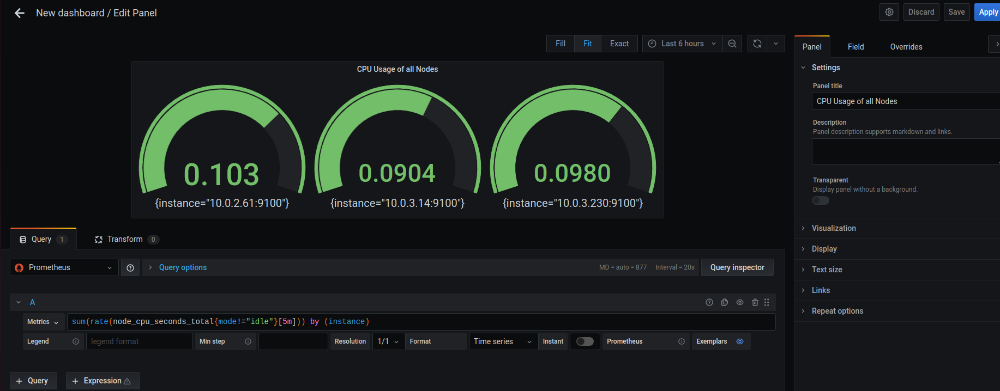

